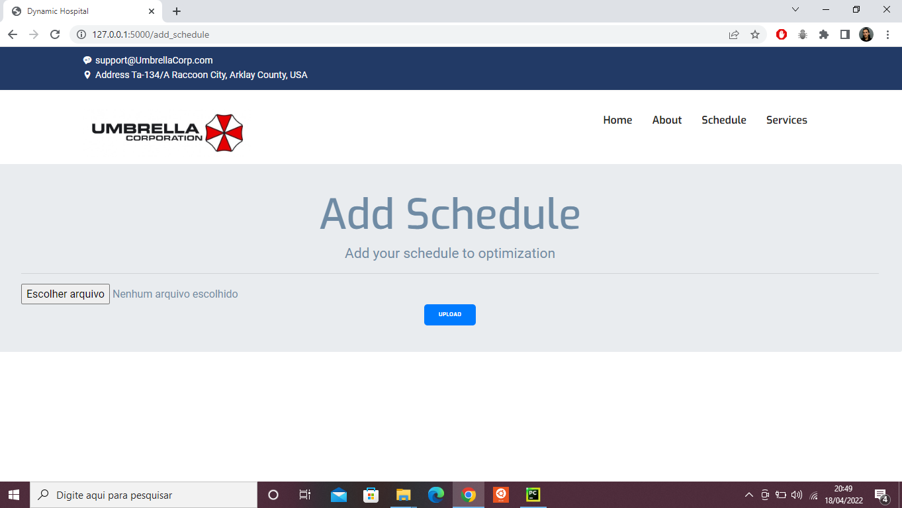
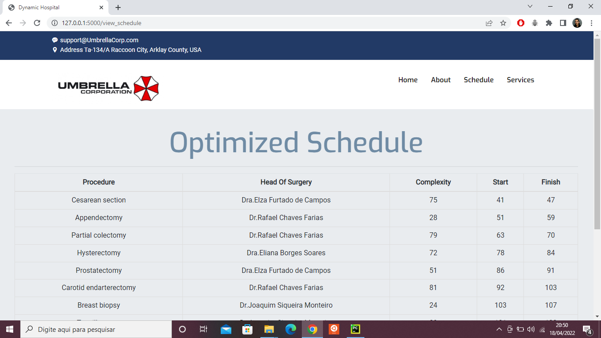

# Dynamic Hospital

**Conteúdo da Disciplina**: Programação dinâmica 

## Alunos
|Matrícula | Aluno |
| ---- | ---------- |
| 17/0034992 | Gustavo Afonso Pires Severo |
| 17/0011119 | Geraldo Victor Alves Barbosa |

## Sobre
O objetivo do projeto é demonstrar a aplicação do algoritmo weighted interval scheduling exatamente para o propósito que foi criado, ou seja, otimizar 
uma agenda de compromissos ponderados, no nosso contexto o peso vai ser entendido como a complexidade de uma
cirurgia, e o objetivo da agenda é que um possível residente de medicina participe do máximo de cirurgias mais complexas possíveis. 

## Screenshots
.

.

.

## Instalação  
**Linguagem**: Python3 
**Framework**: Flask 

- Instale as dependências listadas no arquivo de requirements.
- Rode o flask, isso pode variar de acordo com o sistema operacional, sendo assim sugiro a [Documentação Oficial](https://flask.palletsprojects.com/en/2.0.x/quickstart/#a-minimal-application)

## Uso 
- Rode o projeto e acesse o local host.
- Acesse a página "Schedule" a partir da navbar
- Adicione uma agenda, a primeira linha deve ser igual a do arquivo "exemplo.csv"
- Obtenha a agenda otimizada
